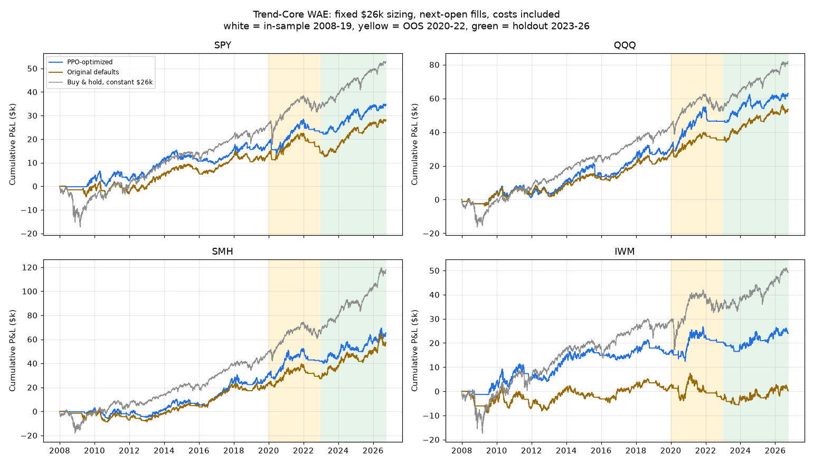

# Trend-Core WAE: audit, Python replica and PPO cross-asset optimization

This folder backs the defaults in `../trend_core_wae_professional.pine`. It holds a bar-by-bar
Python replica of the audited Pine strategy, a PPO parameter search over SPY, QQQ, SMH and IWM,
and the results. Each symbol is tested independently with the same parameter set.

## Bottom line

- The PPO-selected parameters make money in every window on every asset, including the untouched
  2023-2026 holdout. The original defaults lost money on IWM from 2020 to 2022.
- Profit factor is at least 1.65 in every window on every asset. The overlay makes money over
  2008-2026 on every asset. The original overlay lost money on SMH and IWM.
- Three of six robustness gates still fail. Drawdowns on QQQ and SMH exceed 30% of capital, and
  IWM's Sharpe stays between 0.21 and 0.34. Seven PPO seeds across three rounds did not fix either without changing
  the Core entry and exit rules, which were kept as requested.
- Against a constant $26k buy-and-hold, the strategy earns less on every asset. Its Sharpe is
  lower on the holdout. Its value is crash protection: in-sample drawdowns of 25-36% versus
  63-75% for buy-and-hold.
- On the 2023-2026 holdout alone, the original defaults had a higher Sharpe on SPY, QQQ and SMH.
  Over 2020-2026 as a whole the optimized set is equal or better on P&L for all four assets.

## Audit fixes in the Pine script

| Problem | Fix |
|---|---|
| Orders filled at the same close that generated the signal (look-ahead) | `process_orders_on_close = false`: fills at the next open |
| HTF WAE used `lookahead_on` | Completed-bar request with `lookahead_off`; historical and realtime read the same bar |
| HTF `"D"` fails on a daily chart | Auto HTF: intraday uses D, daily uses W, weekly uses M |
| Default FIFO could close Core shares when a tier's exit filled | `close_entries_rule = "ANY"` |
| Entry bar unprotected until the next bar | Stop and target brackets submitted with each entry |
| Overlay could outlive the Core after a trailing-stop fill | Overlay is flattened when the Core is flat |
| Gross exposure cap never limited the overlay | Overlay capped by the gross room above Core cost basis; Reg T `margin_long = 50` |
| Stale campaign state and re-issued exits for closed tiers | State resets when flat; exits re-issued only for open tiers |
| No guard for event or earnings gaps | Optional volatility-shock and gap filters (tested; the optimizer left them off) |
| Core whipsaw after stop-outs | Re-entry cooldown input |
| Bar magnifier needs Premium intraday data and cannot be replicated | Off, for reproducible results |
| No common start date between TradingView and Python | `Trade From` input, default 2008-01-01 |

The script compiles with no errors or warnings in TradingView's Pine compiler.

## Execution and data assumptions

- Daily bars, split-adjusted, not dividend-adjusted. This matches TradingView's default chart data.
  Dividends are excluded, which is conservative for ETFs.
- Fixed paper sizing on $26k: the Core is 100% of capital at each entry, and the overlay risk is
  capped at $65 and at 25% notional. Whole shares only.
- Costs: commission of 0.01% per side, and slippage of 2 ticks on market and stop fills.
- Stops that gap through fill at the open. When a bar reaches both the stop and the target, the
  intrabar path follows TradingView's rule.
- Survivorship: all four ETFs still trade today, and SMH before December 2011 was the older HOLDRS
  product. Results carry that bias.
- TradingView parity: the weekly WAE filter needs about 85 weeks of history. A chart limited to
  5,000 daily bars starts in late 2006, so overlay entries may differ from the replica until mid-2008.

## Validation

- Price data matches TradingView's own OHLCV feed for all four symbols on first open, period high,
  period low and last close.
- Indicators (EMA 20/100/200, ATR 14, RSI 14) match TradingView's values on all four symbols to within
  0.07%. See `results/indicator_parity.md`.
- The replica's accounting balances: equity at a flat bar equals the sum of closed-trade P&L.
- `pine_defaults.py` parses the defaults from the `.pine` file. The replica reproduces the selected
  results exactly from them.
- Not done: a side-by-side run in TradingView's strategy tester. The container's proxy rejects the
  websocket connections TradingView uses for chart data and strategy results. Run the script on a
  daily chart of each symbol to confirm.

## Optimization method

- **Windows.** In-sample 2008-2019, out-of-sample 2020-2022, holdout 2023-2026. The optimizer never
  sees the holdout.
- **Search space.** 28 inputs covering the trend EMA, Core trail and cooldown, WAE lengths and
  thresholds, RSI, ATR stop, tier targets, breakeven and trail, the event guards, and on/off switches.
  The account risk budget is fixed.
- **Agent.** Stable-Baselines3 PPO on a one-step episodic environment: each action is a full
  parameter vector, and its reward is the backtest score. Three rounds were run, about 338,000
  backtests in total.
- **Selection.** The top 40 candidates are rescored on 24 random nearby parameter sets. The winner
  maximizes the neighborhood mean minus half its standard deviation, which avoids sharp peaks.

### Reward

The requested formula subtracted Sharpe, Sortino, win rate and profit factor, which would reward
worse performance. The signs were corrected. Per asset and window:

```python
asset_reward = (pnl_per_year / 4000 + min(sharpe, 3) / 2 + min(sortino, 5) / 2
                + win_rate / 0.60 + min(pf, 10) / 10 - max_dd / 0.30 * 2)
```

Composite reward = mean in-sample asset reward, minus:

- **OOS penalty:** half the fall from in-sample to out-of-sample, 1.0 per asset that loses money
  out-of-sample, and half the worst out-of-sample reward when it is negative.
- **Cross-asset dispersion penalty:** half the standard deviation of asset rewards in-sample and
  out-of-sample, plus half the worst asset's shortfall from the mean in each.
- **Overlay expectancy penalty:** 0.5 per asset and window where the overlay loses money. This was
  added in round 3 because the win-rate term rewarded tiny targets with negative expectancy.
- **Activity penalty:** applied when an asset has fewer than 10 in-sample overlay campaigns.

### Iterations

| Round | Change | Outcome |
|---|---|---|
| 1 | Core allocation included in the search | Stopped early. Allocation went to its 50% floor, because the drawdown term makes shrinking always pay |
| 2 | Allocation fixed at 100%; EMA range widened; learning rate raised | Passed G1 and G2. The overlay lost money on all four assets |
| 2b | Volatility-scaled Core sizing tested at 63-, 252- and 504-day lookbacks | Rejected. Lower out-of-sample returns and no Sharpe gain |
| 3 | Overlay expectancy penalty added; two seeds warm-started from round 2 | Passed G1, G2 and G6; selected |

## Results (selected parameters)

P&L is per year on fixed $26k sizing, net of costs. Max DD is the peak-to-trough drop as a % of
sizing capital. Buy-and-hold holds a constant $26k position.

| Asset | Window | P&L/yr | Sharpe | Sortino | Max DD | Win rate | PF | Trades | Overlay P&L | Overlay PF | Orig. P&L/yr | Orig. Sharpe | B&H P&L/yr | B&H Sharpe | B&H DD |
|---|---|---|---|---|---|---|---|---|---|---|---|---|---|---|---|
| SPY | IS | $1,539 | 0.49 | 0.66 | 24.9% | 63.6% | 3.11 | 176 | $699 | 1.80 | $1,145 | 0.38 | $2,210 | 0.43 | 66.6% |
| SPY | OOS | $1,484 | 0.36 | 0.47 | 22.9% | 60.0% | 3.46 | 40 | $109 | 1.40 | $150 | 0.04 | $2,316 | 0.36 | 38.7% |
| SPY | HOLDOUT | $3,167 | 0.88 | 1.22 | 18.2% | 70.3% | 4.36 | 37 | $200 | 2.30 | $3,757 | 1.18 | $5,203 | 1.34 | 20.5% |
| QQQ | IS | $2,570 | 0.54 | 0.71 | 33.0% | 58.4% | 3.38 | 185 | $422 | 1.36 | $2,261 | 0.60 | $3,656 | 0.67 | 62.8% |
| QQQ | OOS | $5,208 | 0.76 | 1.04 | 33.2% | 61.4% | 10.00 | 44 | $64 | 1.22 | $2,752 | 0.57 | $3,100 | 0.40 | 39.5% |
| QQQ | HOLDOUT | $4,425 | 0.84 | 1.17 | 32.9% | 58.6% | 6.15 | 29 | $53 | 1.28 | $4,902 | 1.03 | $7,724 | 1.48 | 25.2% |
| SMH | IS | $2,579 | 0.48 | 0.65 | 35.6% | 69.2% | 2.68 | 146 | $888 | 2.67 | $1,936 | 0.41 | $4,134 | 0.59 | 74.7% |
| SMH | OOS | $3,597 | 0.44 | 0.61 | 40.8% | 56.0% | 4.28 | 50 | $110 | 1.39 | $1,305 | 0.20 | $5,172 | 0.50 | 53.1% |
| SMH | HOLDOUT | $6,329 | 0.70 | 0.98 | 33.7% | 75.0% | 6.45 | 36 | $250 | 3.46 | $8,143 | 0.99 | $14,171 | 1.53 | 38.3% |
| IWM | IS | $1,381 | 0.34 | 0.46 | 29.2% | 50.7% | 2.23 | 152 | $251 | 1.31 | $196 | 0.05 | $2,454 | 0.39 | 68.7% |
| IWM | OOS | $1,263 | 0.24 | 0.34 | 24.7% | 48.4% | 2.32 | 31 | $0 | 1.00 | -$1,918 | -0.43 | $1,716 | 0.21 | 49.3% |
| IWM | HOLDOUT | $973 | 0.21 | 0.30 | 18.4% | 45.8% | 1.65 | 48 | -$53 | 0.85 | $980 | 0.21 | $3,922 | 0.73 | 31.7% |

For 2020-2026 combined, the Sharpe of the optimized set versus the original was: SPY 0.63 vs 0.63,
QQQ 0.79 vs 0.83, SMH 0.59 vs 0.67, IWM 0.22 vs -0.07.



### Robustness gates

The gates were set before optimization. Every asset must pass each one.

| Gate | Selected | Original |
|---|---|---|
| G1: P&L > 0 in-sample, out-of-sample and in the holdout | Pass | Fail (IWM out-of-sample) |
| G2: profit factor >= 1.2 in every window | Pass | Fail |
| G3: max drawdown <= 30% of capital in every window | Fail (QQQ 33%, SMH 34-41%) | Fail |
| G4: Sharpe >= 0.4 in-sample and over 2020-2026 | Fail (IWM only) | Fail |
| G5: worst 2020-2026 Sharpe >= 0.4 x median | Fail (IWM 0.22 vs median 0.61) | Fail |
| G6: overlay P&L > 0 over 2008-2026 | Pass | Fail |

### Selected parameters

| Input | Original | Selected |
|---|---|---|
| EMA trend length | 150 | 251 |
| Core trailing stop | 5% | 15.25% |
| Core re-entry cooldown | 0 | 12 bars |
| WAE fast / slow EMA | 30 / 90 | 5 / 82 |
| WAE explosion length | 20 | 10 |
| WAE explosion / dead-zone threshold | 0.05 / 0.02 | 0.0101 / 0.0055 |
| RSI filter | On (14, >= 60) | Off |
| Momentum hard exit | On | Off |
| ATR length / overlay stop | 21 / 1.5 ATR | 12 / 4.0 ATR |
| Tier targets | 1R / 2R / 4R | 0.5R / 0.75R / 1.25R |
| Tier 3 trail start / width | 2R / 1.0 ATR | 1.11R / 0.5 ATR |
| HTF WAE and EMA slope filters | On | On |
| Event guards (volatility shock, gap) | n/a | Off |

With a 4 ATR stop, a 1R target is 4 ATR, so the tier targets sit 2 to 5 ATR above entry. The
breakeven trigger at 1.62R is above the 1.25R Tier 3 target, so in practice Tier 3 exits through its
target or its ATR trail.

## What would clear the remaining gates

These change either the Core rules or the account's sizing, so they need your decision:

1. **Lower Core allocation on QQQ and SMH** would bring drawdowns under 30%. The reward alone would
   shrink every asset, so this has to be an explicit per-account choice.
2. **An exit band or confirmation around the trend EMA** would cut the repeated small Core losses when
   price hugs the EMA, as in 2010 and 2015-16. This changes the Core exit logic.
3. **Holding IWM to a lower bar or dropping it.** IWM's buy-and-hold Sharpe was 0.06 from 2020 to 2022,
   so a trend filter has little to work with.

## Reproduce

```bash
pip install -r rl_optimizer/requirements.txt
cd rl_optimizer
python data_loader.py                                   # refresh daily data
python baseline.py                                      # original defaults
python ppo_optimize.py --steps 45000 --seed 11 --tag r3 --init results/r2_selection.json
python select_and_report.py --tag r3                    # neighborhood selection, gates, holdout
python plot_results.py r3
python pine_defaults.py                                 # defaults parsed from the .pine file
```

Raw per-evaluation logs (`*.jsonl`) and PPO checkpoints are not committed because of their size.
